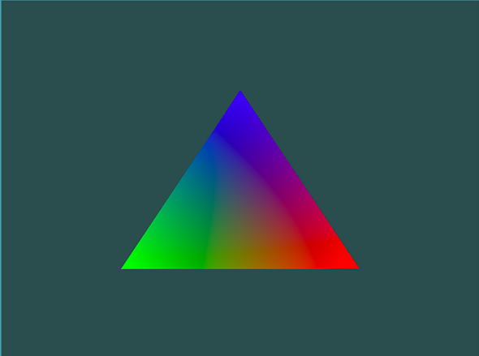
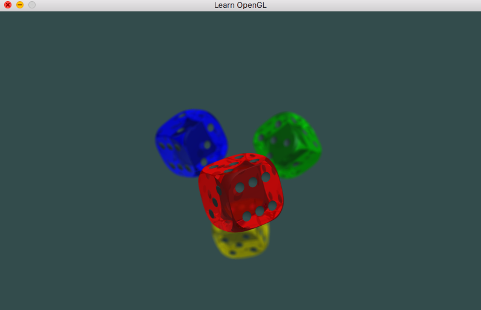
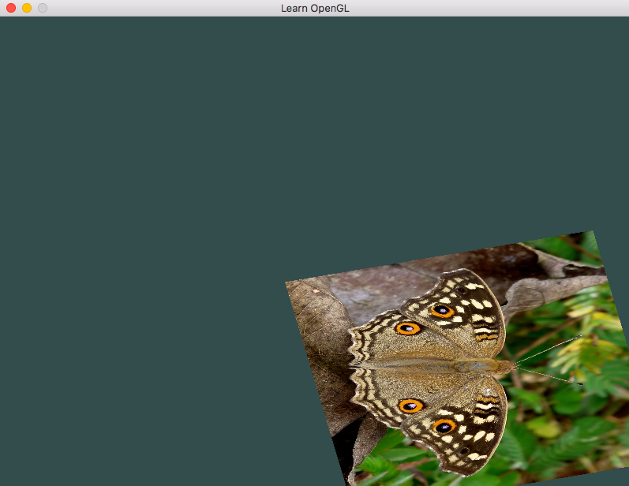
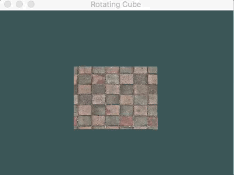
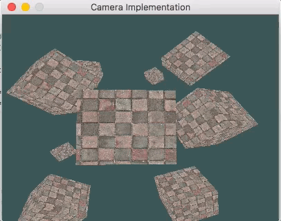
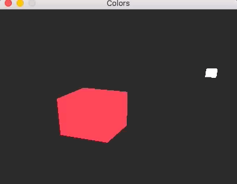
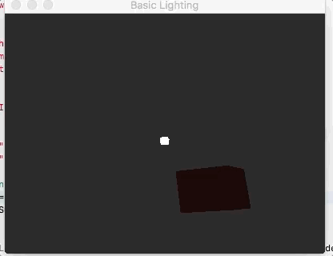
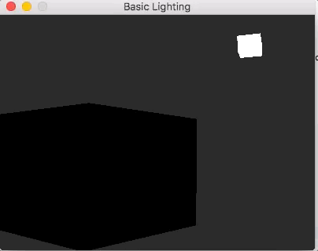

# OpenGL Playground
### 1. <a href="https://github.com/JP01/open_gl/tree/fc28d2dd477351f55deafaa4beb229a56c269324">"Hello Triangle"</a>
Show a triangle on screen with RGB and interpolated coloring. 

### 2. <a href="https://github.com/JP01/open_gl/tree/c4122dc57528bb0282163220996c9c118284bb39">Texturing"</a>
Create a rectangular texture using 2 triangles. 

### 3. <a href="https://github.com/JP01/open_gl/tree/339c795ec159959110b655a5fa403fef413f8d1f">"Transformations"</a>
Translate and Rotate a textured object. 

### 4. <a href="https://github.com/JP01/open_gl/tree/2563fd606cbe23b7948e7b6f65570b55ba4bfcac">"Projections and Coordinate system"</a>
Create a Perspective view of a rotating cube. 

### 5. <a href="https://github.com/JP01/open_gl/tree/606398f3b1abb6ced6c78976023e86bcc8477bc5">"Camera"</a>
Implement a user controlled camera that allows movement through the world. 

### 6. <a href="https://github.com/JP01/open_gl/tree/91987f9f099799abd1d8f7469b91eb313453f5ab">"Colors"</a>
Create a lamp and box of different colors, ready for lighting. 

### 7. <a href="https://github.com/JP01/open_gl/tree/01cce650e7d5def4a60a4c6638920438368d9a7f">"Basic Lighting"</a>
Create a scene with ambient, diffuse and specular lighting. 

### 8. <a href="https://github.com/JP01/open_gl">"Materials"</a>
Create a box with variable material properties.

